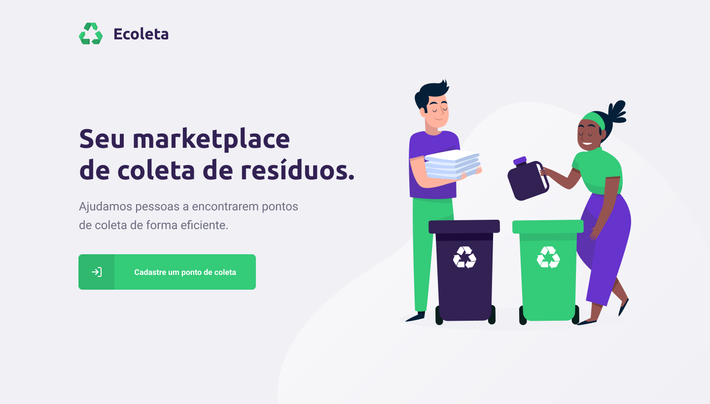
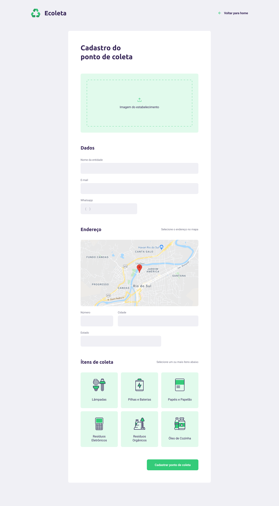
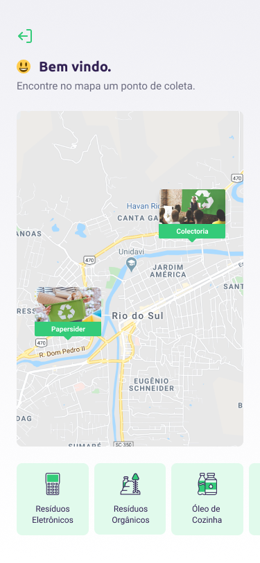
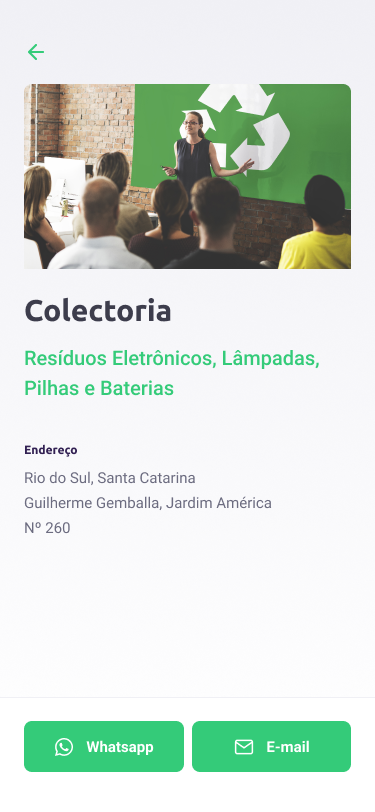

# Ecoleta

## :recycle: O projeto

Aplicação desenvolvida durante o evento _Next Level Week_, promovido pela empresa de educação em desenvolvimento web _[Rocketseat](https://rocketseat.com.br/)_

O _Ecoleta_ é uma aplicação de cadastro de pontos de coleta de resíduos, desenvolvida com Node.js, ReactJS e React Native, juntamente com o TypeScript.

## :computer: Web

## :iphone: Mobile

